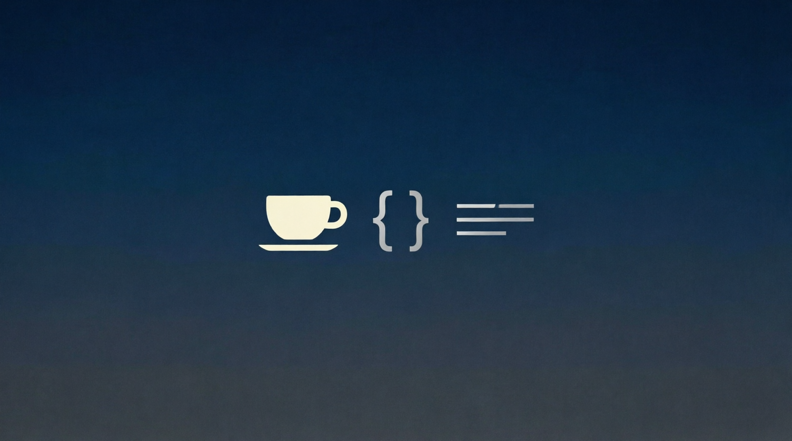

<h1 align="center">Привет, меня зовут Константин 👋</h1>
<h3 align="center">⚖️ Юрист | 💻 Java Developer</h3>

---

### 🧑‍⚖️ Обо мне

Я практикующий юрист с более чем **20-летним опытом**.  
Несколько лет назад увлекся программированием на Java. Удивительно, но оказалось, что у юриспруденции и программирования много общего. 

### 📌 Сейчас

- 💻 Пишу pet-проекты
- 🌱 Изучаю **Java**, **SQL**, **Spring**

---

### 🛠 Технологический стек

#### Языки программирования

  

#### Базы данных

  
  

#### Spring Framework

  
  
  

#### Инструменты и библиотеки

  
  
  
  
  

#### Тестирование

  

---
## 🗣️ Языки

- **русский** (родной)
- **английский** (C1)

---

## 📊 GitHub статистика

  

  

---

---

> 🔗 Все проекты доступны в [моих репозиториях](https://github.com/kstefankov?tab=repositories)

---

### 🤝 Связаться со мной

  

---

*Этот README автоматически отображается на главной странице моего GitHub-профиля. Спасибо, что заглянули!*
